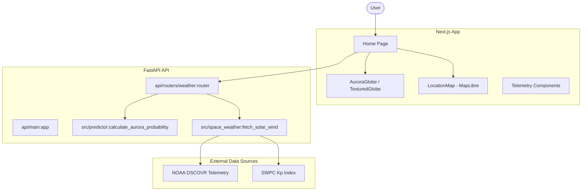

# Architecture

> Auto-generated by /map on 2026-03-16

## Overview

AuroraLens is an AI-powered space weather and aurora borealis forecasting application. It provides real-time global aurora probability scores based on solar wind telemetry and geomagnetic indexes.

## Components

### Frontend (Next.js)
- **Purpose:** User interface for visualizing aurora forecasts and space weather.
- **Location:** `frontend/`
- **Key Files:**
    - `src/app/page.tsx`: Landing page and data orchestration.
    - `src/components/AuroraGlobe.tsx`: 3D WebGL visualization of the Earth and aurora.
    - `src/components/LocationMap.tsx`: Interactive MapLibre-based map for precise location focusing.
    - `src/components/Navigation.tsx`: Floating navigation overlay.

### Backend (FastAPI)
- **Purpose:** Data aggregation, ML inference, and API serving.
- **Location:** `api/`
- **Key Files:**
    - `main.py`: Application entry point and CORS configuration.
    - `routers/weather.py`: Endpoints for global forecast and historical telemetry.

### ML & Data Processing
- **Purpose:** Core logic for predicting aurora score based on solar wind data.
- **Location:** `src/`
- **Key Files:**
    - `predictor.py`: XGBoost-based inference engine.
    - `space_weather.py`: Module for fetching and cleaning data from NOAA/SWPC.

## Data Flow

1. **User Action:** User visits the dashboard or selects a location.
2. **Frontend Request:** Frontend fetches `/api/weather/forecast/global` and `/api/weather/telemetry/history`.
3. **Backend Processing:**
    - `weather.py` router triggers `space_weather.py` to fetch real-time solar wind data (Bz, Bt, Speed, Density, Kp).
    - Fetched data is passed to `predictor.py`.
    - `predictor.py` runs inference using an XGBoost model to calculate an aurora score.
4. **Response:** Backend returns structured JSON with scores, telemetry, and descriptive messages.
5. **Visualization:** Frontend updates the 3D globe, charts, and status indicators.

## Integration Points

| Service | Type | Purpose |
|---------|------|---------|
| NOAA DSCOVR | HTTP | Solar wind telemetry (magnetic field, plasma) |
| SWPC | HTTP | Kp index and geomagnetic alerts |
| MapLibre / OpenStreetMap | WebGL | Interactive 2D/3D map overlay |

## Technical Debt

- [ ] **Hardcoded URLs:** `127.0.0.1:8000` is hardcoded in frontend components; should use environment variables.
- [ ] **Placeholder Assets:** UI uses `picsum.photos` for the gallery; needs real or generated aurora imagery.
- [ ] **Error Handling:** Minimal retry logic or robust error states for when NOAA data is flaky.
- [ ] **Legacy Code:** `Streamlit` references in `requirements.txt` and potentially some old scripts.
- [ ] **Testing:** Lack of automated unit or integration tests for the prediction engine and API.

## Conventions

**Naming:** PascalCase for React components, camelCase for props and variables, snake_case for Python modules and functions.
**Structure:** Feature-based directory structure (though currently evolving).
**Testing:** None observed yet.
