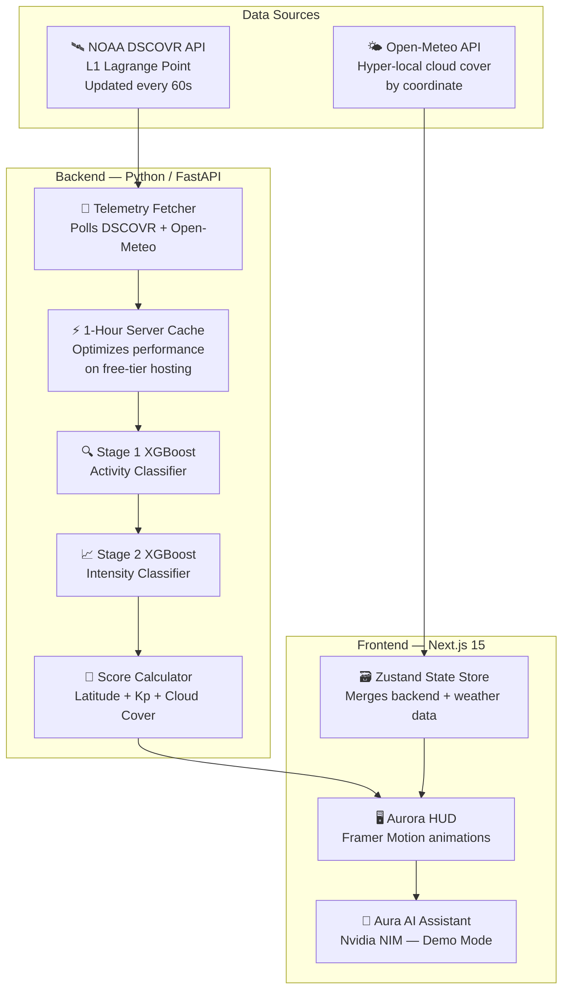
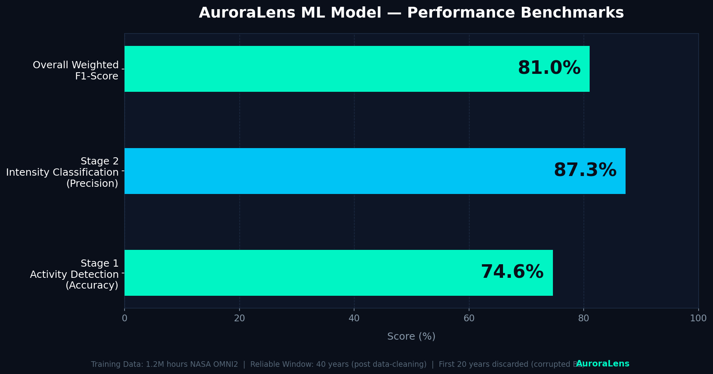

# AuroraLens 🌌

> **Will you see the aurora tonight?**  
> Real-time aurora visibility scoring for your exact location —  
> powered by live NASA satellite data and a dual-stage XGBoost ML pipeline.

---

### 📝 Project Evolution: From Regional Study to Global Intelligence
*Originally conceived as **Aurora Kashmir**, this project began as a localized exploration of geomagnetic data. As the vision scaled and the telemetry engine matured to process real-time NASA L1 data for any coordinate on Earth, it evolved into **AuroraLens**—a high-fidelity, global platform for aurora intelligence. We maintain our roots in open science while looking toward a global horizon.*

---

[](https://opensource.org/licenses/MIT)
[](https://nextjs.org/)
[](https://fastapi.tiangolo.com/)
[](https://xgboost.readthedocs.io/)
[](https://omniweb.gsfc.nasa.gov/)
[](https://auroralens.online)

**[🌐 Live Demo](https://auroralens.online)** · **[📖 Developer Docs](https://auroralens.online/developer)** · **[🔬 ML Specification](ML_ENGINE_SPEC.md)** · **[🐛 Report a Bug](https://github.com/mosiinmushtaq70-a11y/aurora-kashmir/issues)** · **[💡 Request a Feature](https://github.com/mosiinmushtaq70-a11y/aurora-kashmir/issues)**

---

## 🌟 What Is AuroraLens?

The aurora borealis — the Northern Lights — is one of the most breathtaking natural phenomena on Earth. But seeing it depends on a complex set of conditions: the strength of the solar wind hitting Earth's magnetic field, the orientation of the interplanetary magnetic field, your latitude, and whether the sky above you is clear.

Most aurora apps give you a single global KP number and tell you to figure it out.

**AuroraLens does something different — it calculates your personal score.**

We pull live data from NASA's DSCOVR satellite (sitting 1.5 million km from Earth at the L1 Lagrange point), combine it with your exact latitude and real-time local cloud cover, then run it through a machine learning model trained on 40 years of geomagnetic records.

The result: a **0–100 visibility score for the exact location where you are standing, right now.**

---

## ✨ Features

| Feature | Description |
|---|---|
| 🎯 **Personal Aurora Score** | 0–100 score calculated for your GPS coordinates, not just a global average |
| 🛰️ **Live DSCOVR Telemetry** | Bz(GSM), solar wind speed, and planetary Kp index refreshed every 60 seconds from NASA |
| 🤖 **Dual-Stage XGBoost Model** | Stage 1 detects geomagnetic activity, Stage 2 classifies Kp intensity |
| 🌍 **Dynamic Global Pulse** | 50–350 live activity nodes scaled scientifically by current planetary Kp levels |
| 📷 **Aura AI Assistant** | Astrophotography companion that suggests ISO, shutter speed, and aperture for tonight |
| 🔍 **Location Search** | Search any city or coordinates on Earth for a personalised forecast and if you wanna jump straight in , just click the direction icon and the google map with the selected location will pop up |
| 📡 **Open Source** | Full codebase, ML training pipeline, and documentation publicly available |

---

## 🧠 How It Works

### The Aurora Visibility Score

The core of AuroraLens is a machine learning model that processes real-time solar wind data into a human-readable score. Here is how each variable contributes:

| Variable | Weight | Why It Matters |
|---|---|---|
| **Kp Index** | 40% | The planetary K-index is the standard measure of global geomagnetic activity. Anything above KP-5 typically produces visible aurora at high latitudes. |
| **IMF Bz (GSM)** | 30% | The southward component of the interplanetary magnetic field. When Bz is negative (pointing south), solar wind connects with Earth's field and drives aurora. |
| **Solar Wind Speed** | 20% | Faster solar wind (above 500 km/s) carries more energetic particles into the magnetosphere. |
| **Cloud Cover** | -10% | Penalises the score based on real-time local cloud cover at your GPS coordinates. |

### The Global Hotspot Formula

The live hotspot counter on the landing page is 100% data-driven — it scales dynamically with real Kp data:

```
hotspots = round(50 + (kp_index / 9) * 300)
```

- **Kp 0–2 (Quiet):** ~50–110 locations globally
- **Kp 5–6 (Minor Storm):** ~220–250 locations
- **Kp 8–9 (Severe Storm):** ~330–350 locations

### System Architecture



---

## 🤖 ML Model Performance Benchmarks



| Metric | Value |
|---|---|
| Stage 1 — Activity Detection Accuracy | 74.6% |
| Stage 2 — Intensity Classification Precision | 87.3% |
| Overall Weighted F1-Score | 81.0% |
| Test Dataset Size | 1.2 million hours of NASA OMNI records |

For a deep dive into feature engineering and training methodology, see **[ML_ENGINE_SPEC.md](ML_ENGINE_SPEC.md)**.

---

## 🛠️ Tech Stack

| Layer | Technology | Why |
|---|---|---|
| **Frontend** | Next.js 15, React 19, Tailwind CSS 4 | Server-side rendering and performance |
| **Animations** | Framer Motion | `whileInView` rendering saves GPU cycles |
| **Backend** | Python / FastAPI | High-performance async handling of telemetry data |
| **ML Model** | XGBoost (dual-stage) | High accuracy for non-linear time-series prediction |
| **Database** | Supabase (PostgreSQL) | Persistence layer for telemetry and user data |
| **Live Data** | NOAA DSCOVR, Open-Meteo | Scientifically authoritative real-time APIs |
| **AI Assistant** | Nvidia NIM (Demo Mode) | Powers the Aura astrophotography chatbot |
| **Deployment** | Vercel (frontend), Render (backend) | 100% free-tier architecture |

---

## 🚀 Quickstart

**Prerequisites:** Node.js 18+, Python 3.10+, Git

### 1. Clone the Repository

```bash
git clone https://github.com/mosiinmushtaq70-a11y/aurora-kashmir
cd aurora-kashmir
```

### 2. Frontend Setup

```bash
cd frontend
npm install
npm run dev
```

### 3. Backend Setup

```bash
cd ../backend
python -m venv venv
source venv/bin/activate # Windows: .\venv\Scripts\activate
pip install -r requirements.txt
python main.py
```

The backend API will be running at `http://localhost:8000` (FastAPI Default).

---

## ⚠️ Project Status

Current known limitations:
- Aurora score accuracy below latitude 45°N is undergoing calibration
- Forecast horizon beyond 3 hours is experimental
- **All Global Hotspots are 100% Live & Data-Driven**

---

## 👨‍💻 About the Developer

**Mosin Mushtaq**  
B.Tech Artificial Intelligence & Machine Learning, SKUAST 2026  
Kashmir, India

I built AuroraLens to turn open NASA datasets into a personal, high-fidelity experience. As an AI student with a passion for space weather, I wanted to bridge the gap between raw telemetry and real-world visibility.

[](https://www.linkedin.com/in/mosiin-mushtaq)
[](https://github.com/mosiinmushtaq70-a11y)

---

## 📄 License

MIT © 2026 Mosin Mushtaq
