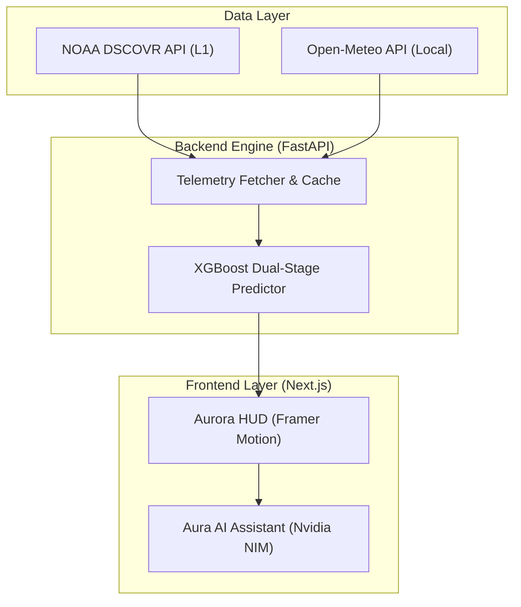

# AuroraLens 🌌

> **Will you see the aurora tonight?**  
> Real-time aurora visibility scoring for your exact location — powered by 
> live NASA satellite data and a dual-stage XGBoost ML pipeline.

[](https://opensource.org/licenses/MIT)
[](https://nextjs.org/)
[](https://www.python.org/)
[](https://xgboost.readthedocs.io/)
[](https://omniweb.gsfc.nasa.gov/)
[](https://github.com/mosiinmushtaq70-a11y/aurora-kashmir)

[Live Demo](https://auroralens.online) · [Developer Docs](/developer) · 
[ML Specification](ML_ENGINE_SPEC.md) · [Report Bug](https://github.com/mosiinmushtaq70-a11y/aurora-kashmir/issues) · 
[Request Feature](https://github.com/mosiinmushtaq70-a11y/aurora-kashmir/issues)

---

## What Is This?

Most aurora apps show you a global KP number.  
AuroraLens calculates **your personal score**.

We combine live magnetic field data from NASA's DSCOVR satellite 
(1.5 million km away) with your exact latitude and real-time cloud cover, 
then run it through a dual-stage ML model trained on 40 years of 
geomagnetic records.

Result: a 0–100 visibility score for where you are standing, right now.

---

## Features

- **Personal Aurora Score** — 0–100 visibility score recalculated for 
  your GPS coordinates
- **Live DSCOVR Telemetry** — Bz(GSM), solar wind speed, cloud cover 
  refreshed every 60 seconds
- **Dual-Stage XGBoost Model** — Stage 1 detects activity, Stage 2 
  classifies KP intensity
- **Aura AI** — Astrophotography assistant that suggests ISO, shutter 
  speed, and aperture based on live conditions
- **Global Hotspot Nodes** — Direct teleportation to Kirkjufell, 
  Tromsø, and Fairbanks
- **Open Source** — Full codebase, ML spec, and training pipeline 
  publicly available

---

## Architecture



---

## Tech Stack

| Layer | Technology |
|---|---|
| Frontend | Next.js 15, React 19, Tailwind CSS 4, Framer Motion |
| Backend | FastAPI (Python 3.10) |
| ML Model | XGBoost, scikit-learn, pandas, numpy |
| Database | Supabase (PostgreSQL) |
| Live Data | NOAA DSCOVR API, Open-Meteo API |
| Training Data | NASA OMNI2 Dataset (1981–2023) |
| Deployment | Vercel |
| CI/CD | GitHub Actions |

---

## Quickstart

To run AuroraLens locally, follow these steps:

### 1. Clone the repository
```bash
git clone https://github.com/mosiinmushtaq70-a11y/aurora-kashmir
cd aurora-kashmir
```

### 2. Frontend Setup
```bash
cd frontend
npm install
cp .env.example .env.local
# Fill in your Supabase keys in .env.local
npm run dev
```

### 3. Backend Setup
```bash
cd ../backend
python -m venv venv
source venv/bin/scripts/activate # Windows: .\venv\Scripts\activate
pip install -r requirements.txt
python main.py
```

---

## Environment Variables

| Variable | Purpose | Source | Required |
|---|---|---|---|
| `NEXT_PUBLIC_SUPABASE_URL` | Supabase project URL | Supabase Dashboard | Yes |
| `NEXT_PUBLIC_SUPABASE_ANON_KEY` | Anonymous API key | Supabase Dashboard | Yes |
| `DATABASE_URL` | PostgreSQL connection string | Supabase Settings | Yes |
| `NVIDIA_API_KEY` | Aura AI assistant engine | Nvidia NIM | Optional |

---

## Data Sources

- **NOAA DSCOVR** — Real-time solar wind from L1 Lagrange point  
  Endpoint: `https://services.swpc.noaa.gov/json/rtsw/rtsw_mag_1m.json`
- **NASA OMNI2** — 40-year historical hourly solar wind dataset  
  Source: https://omniweb.gsfc.nasa.gov/
- **Open-Meteo** — Hyper-local cloud cover by coordinate  
  Endpoint: `https://api.open-meteo.com/v1/forecast`

> **Note on Large Files**: The NASA OMNI2 training dataset (~59MB) is not included in this repository due to size limits. Download instructions are provided in [ML_ENGINE_SPEC.md](ML_ENGINE_SPEC.md). The trained XGBoost model weights (`.pkl`) are available as a GitHub Release asset.

---

## ML Model

The AuroraLens prediction engine uses a **dual-stage XGBoost pipeline**:
1. **Stage 1 (Activity Detection)**: Classifies whether current solar wind conditions are likely to produce geomagnetic disturbance.
2. **Stage 2 (Intensity Classification)**: Predicts the specific KP-index and local visibility score based on latitude and environmental interference.

Link to full technical spec: [ML_ENGINE_SPEC.md](ML_ENGINE_SPEC.md)

Performance:
- Stage 1 (Activity Detection): 74.6% accuracy
- Stage 2 (Intensity Classification): 87.3% precision  
- Overall weighted F1: 81.0% across 1.2M hours of NASA test data

---

## Project Status

Current known limitations:
- Visibility scores for demo location nodes are not yet live (teleport only)
- Aurora score accuracy below latitude 45°N is limited
- Forecast horizon beyond 3 hours degrades significantly

---

## Contributing

See [CONTRIBUTING.md](CONTRIBUTING.md) for setup instructions, branch naming, and PR checklist.

---

## About the Creator

**Mosin Mushtaq**  
B.Tech student in Artificial Intelligence & Machine Learning  
Tech and space enthusiast passionate about space weather, exploration, and missions. Built AuroraLens to explore real-time geomagnetic prediction using open NASA datasets.

[LinkedIn](https://www.linkedin.com/in/mosiin-mushtaq) · [GitHub](https://github.com/mosiinmushtaq70-a11y)

*A dedicated space weather monitoring platform (infrastructure-focused) is currently in development.*

---

## License

MIT © 2026 Mosin Mushtaq
